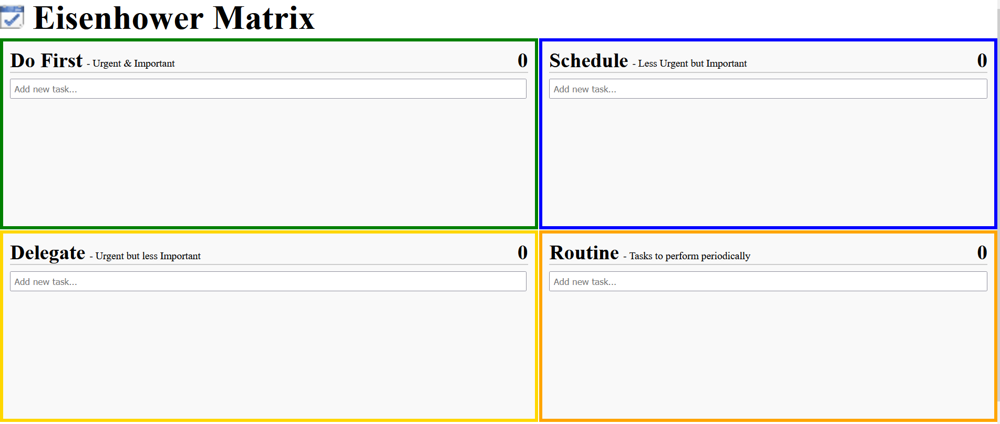

# Task-Manager-Eisenhower-Matrix

## Introduction
What is the Eisenhower Matrix?

The Eisenhower Matrix helps you decide on and prioritize tasks by urgency and importance, sorting out less urgent and important tasks which you should either delegate or not do at all.

Dwight D. Eisenhower was the 34th President of the United States from 1953 until 1961. Before becoming President, he served as a general in the United States Army and as the Allied Forces Supreme Commander during World War II. He also later became NATO’s first supreme commander.
Dwight had to make tough decisions continuously about which of the many tasks he should focus on each day. This finally led him to invent the world-famous Eisenhower principle, which today helps us prioritize by urgency and importance.

Prioritizing tasks by urgency and importance results in 4 quadrants with different work strategies:
➀ Do First: First focus on important tasks to be done the same day.
➁ Schedule: Important, but not-so-urgent stuff should be scheduled.
➂ Delegate: What’s urgent, but less important, delegate to others.
➃ Don’t Do: What’s neither urgent nor important, don’t do at all.

## This version
This version store your tasks locally on your browser and computer. This means if you change the browser and/or the computer you will not see your task anymore.

